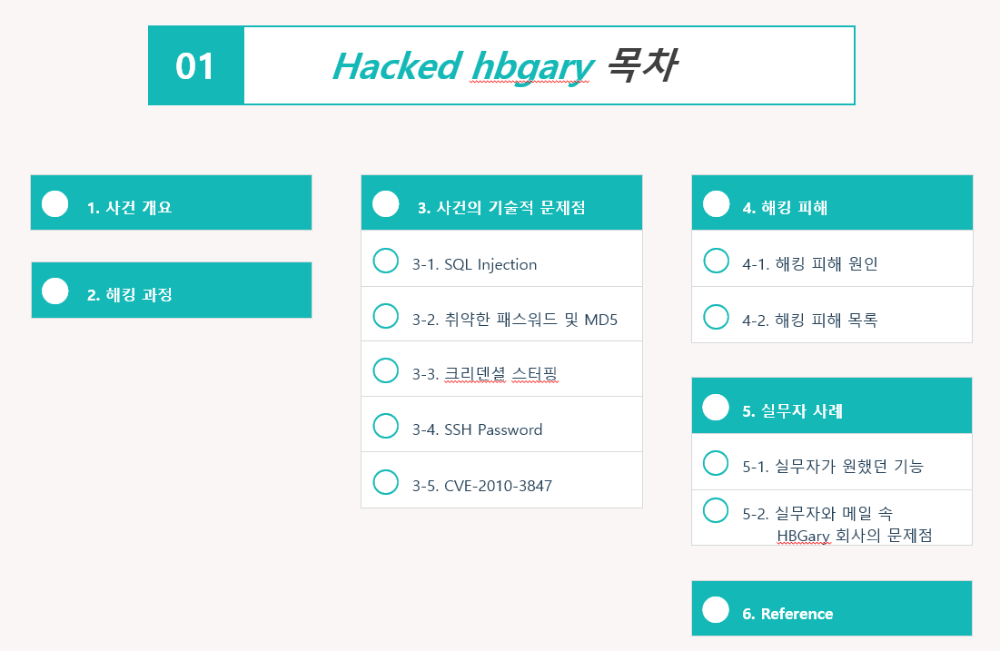
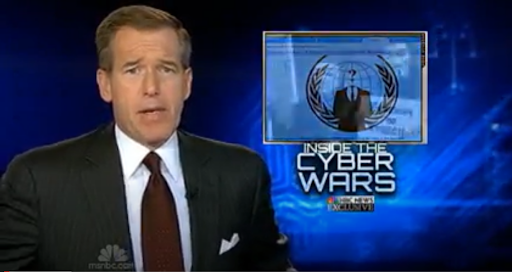
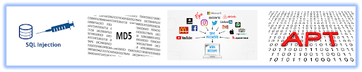
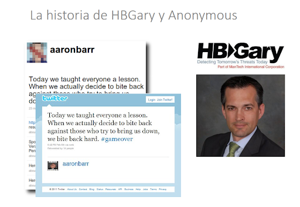

# HBGary 해킹 사건

**팀명** : 0번방의 선물  
**팀원 및 기여도**  - 김주원(16.7%),박성광(16.7%), 송해원(16.7%), 심성보(16.7%), 안희성(16.7%), 양희성(16.7%)   
   

## 목차

   

## 1. 사건 개요

HBGary 회사는 Greg Hoglund가 세운 보안회사로 현재는 IT 서비스 업체인 ManTech International의 자회사다. 원래는 HBGary Federal와 HBGary, Inc. 이 2개의 회사로 나뉘어 있었지만 HBGary로 통합해서 불리며 컴퓨터 보안 업계의 전문 회사로서 자리매김하고 있었다.    
HBGary Federal을 새롭게 설립할 당시 Aaron Barr(미 해군 암호 전문가, 프로그래머, 시스템 분석가로 복무)가 HB에 투자를 하며 보안업계에 뛰어들었다. 당시 Aaron Barr는 어나니머스라는 해킹 집단에 관심을 두고 있었고, Aaron Barr는 파이낸셜 타임스에 어나니머스 회원에 대한 정보를 갖고 있다고 말했다. 한 컨퍼런스에서 소셜네트워크의 보안 취약성에 대해 언급하며 어나니머스의 익명성을 파헤칠 수 있다고 언급하였다. 본인이 그들의 정보를 어느 정도 갖고 있고, 그들의 신원을 밝힐 준비를 하고 있었다.    
이에 대해 어나니머스의 반응은 빠르고 공격적이었다. HBGary의 서버는 침입당했고, 이메일은 도용되어 세상에 공개되었으며, 데이터는 파괴되었으며, 웹사이트는 훼손되었다. 추가로 HBGary의 소유주인 Greg Hoglund가 소유하고 운영하는 두 번째 사이트가 오프라인으로 전환되고 사용자 등록 데이터베이스가 공개되었다. 결국 HBGary Federal의 CEO 애론 바는 자신의 자리에서 물러나게 되었다.    
(당시 HBGary 회사에서는 rootkit.com 서비스를 제공하고 있었는데, rootkit.com 사이트는 논란의 여지가 많은 사이트였다. Rootkit.com 서비스의 취지가 모든 익명 사용자들의 가면을 벗기겠다는 취지에서 만들어졌기에 그의 사이트는 유명 해커들을 목표로 삼고 있었다. 그런 의미로 해당 사이트는 익명성도 존중을 받아야 한다는 논란을 만들기 충분했고, 이 때문에 익명성을 존중하라는 의미에서 해킹을 당했다는 이야기도 있다.)
    

## 2. 해킹 수행 과정
    1. 2011년 2월 6일 웹사이트 SQL 인젝션 수행
    2. 위 공격을 통해 사용자의 암호 탈취
    3. 탈취한 암호를 통해 HBGary 사의 메일을 접속
    4. CEO의 메일 계정으로 로그인 후 민감 정보 탈취
    5. 웹서버의 암호 역시 동일하였음, 웹 DB 유출
  

## 3. 사건의 기술적 문제점
- **SQL 인젝션에 취약한 서버 관리**   
HBGary는 자사의 웹사이트인 hbgaryfederal.com에 대한 구축 및 관리가 부족하였다. 그래서 콘텐츠 관리를 용이하게 해주는 기술 CMS를 기성 CMS 대신 타사 개발자에게 맞춤형 CMS 시스템을 의뢰하게된다.
그러나, 미숙한 구현으로 인해 CMS는 SQL Injection 공격에 쉽게 희생양이 되었다. 가령, 사이트 내 특정 글을 불러오기 위해 사용되는 글번호 매개변수에 대한 검증 미 수행하여, 룰즈섹은 매개변수 조작을 통해 해당 웹사이트 DB에 접근할 수 있었다.
침투 URL : http://www.hbgaryfederal.com/pages.php?pageNav=2&page=27 pageNav 파라미터와 page 파라미터를 사용하였다.
- **취약한 패스워드 해시 알고리즘 사용 및 간단한 비밀번호 조합**   
복잡성이 낮고 잘 알려져 있는 MD5 알고리즘을 이용하여서 레인보우 테이블 공격에 매우 취약했다. 추가로 CEO인 Aaron Barr와 COO Ted 암호가 매우 간단한 조합으로 구성되어 있었다.
매우 단순 한 소문자 6개 숫자 2개 암호를 사용해서 쉽게 패스워드를 얻어내는 것이 가능
- **여러 사이트에서 동일한 암호를 사용 (크리덴셜 스터핑)**
HBGary 사의 웹 서버로의 SSH이 열려있었고, 암호 역시 먼저 인젝션으로 탈취당한 COO Ted의 PW와 동일. 다시 말해 서버의 접근 암호와 개인 사용 암호를 동일하게 사용하는 관리적 문제가 있었다.
게다가 민감한 서버로의 접속에 암호 방식을 이용한 것 역시 문제였는데, 보안을 생각한다면 공개키 암호화 방식을 채용하는 것이 보안에 좋다.
접속은 했지만 권한은 일반 사용자 권한이어서 권한 상승이 필요했다.
- **CVE-2010-3847(Command Injection 을 사용하여 Local 환경에서의 root 권한을 획득)을 통한 계정 권한 상승**   
SSH 접근 권한을 가진 서버와 웹 서버에 접근 가능한 임원(Ted)의 계정 유출로 인해 각 서버에 접근이 가능해졌고, 패치되지 않은 취약한 서버의 환경으로 알려진 취약점인 CVE-2010-3847을 통해 계정의 권한을 상승하였다.
- **rootkit.com 사이트 탈취를 위한 사회 공학적 기법**   
초기 인젝션을 통해 알아낸 CEO인  Aaron의 비밀번호를 통해 Google Apps를 접속했고, 메일을 액세스 할 수 있었는데 Aaron은 회사 메일 관리자이기도 해서 자신의 메일뿐만 아니라 회사의 모든 메일에 액세스 할 수 있었다.   
Greg Hoglund 메일에 액세스 후 Greg의 Rootkit.com 사이트 실행 컴퓨터 루트 암호를 탈취하고 접속권한만 얻으면 되었는데, 이를 해결하기 위해 룰즈섹은 Jussi Jaakonaho 에게 자신의 비밀번호를 직접 전달하며 신뢰성을 얻는 거짓 메일을 보내 담당자를 속이고 접속 권한을 얻어냈다.
   

## 4-1. 해킹 피해 원인
    1. SQL Injection에 취약한 웹서버
    2. 취약한 암호 알고리즘을 사용, MD5
    3. CEO가 동일한 암호를 이곳저곳에서 사용, CEO의 개인 메일 비밀번호와 웹서버 접속 패스워드가 동일(크리덴셜 스터핑 공격)
    4. 이메일 발신자의 검증을 제대로 수행하지 못한 APT공격 무방비
   
  

## 4-2. 해킹 피해 목록

- HBGary의 CEO Aaron Barr의 Facebook, Twitter, Yahoo 및 그의 WoW 계정을 탈취   
- HBGary Federal 홈페이지에 메시지를 게재
- CEO Aaron Barr 트위터에 인종차별적 메시지 게시
- Pirate Bay 토렌트 파일에 60,000개 이상의 HBGary 이메일 캐시 공개
- Bank of America 측에 WikiLeaks 신용 하락 계획 제안 내용 유출
- 기가바이트급 백업 데이터와 연구 자료가 탈취
- 그렉 호글런드(Greg Hoglund)의 rootkit.com을 사회공학 기법으로 SSH를 뚫어 내부에 있는 전체 내용을 삭제
- 다른 HBGary 임원들의 LinkedIn 계정도 수분 만에 손상
   

## 5-1. 실무자(이강석 멘토님)이 원했던 기능
멘토님과 HBGary 회사가 주고받은 메일 내용에 따르면, 멘토님은 **Blackhat 2007**에 발표된 그리고 HBGary의 메인 사이트 하단 링크에 있던 동영상에 나온 **‘런타임 분석 기능’** 을 원하셔서 Responder를 구입하셨다. 그러나 구매 후 해당 기능이 제대로 작동하지 않으며 버그가 있음을 알게 되었고, 다른 PC에도 테스트해봄과 동시에 해당 문제와 관련해 pdf와 동영상까지 제작해 당사에 연락을 취하였다.
   

## 5-2. 실무자와의 메일 속 HBGary 회사의 문제점
멘토님과 HBGary가 주고받은 이메일을 살펴보면 다음과 같다.
1. Responder의 런타임 분석 기능에 문제가 있음을 깨닫고 다른 PC에 테스트해봄과 동시에 관련 문제를 설명하기 위해 pdf와 동영상을 제작해 HBGary 회사에 여러 차례 이메일을 전송.
2.  HBGary 사는 아무도 답장을 해주지 않음. 
3.  재차 이메일을 보낸 끝에, 답변이 왔으나 HBGary 사로부터 정확한 답변을 받지 못하고 해당 디버거가 곧 종료되고 향후 Flypaper Pro로 교체될 것이라고 회신.
4. 결국 원하는 기능을 얻지 못한 채 환불을 받음.
멘토님이 원한 것은 "런타임 분석"이 테스트한 다른 여러 기계들에 대해 작동하지 않는 "정확한" 이유와 Responder의 다른 고객들도 같은 문제를 겪고 있는지 알고 싶은 것이었으나, 당사는 문제상황(디버거 기능에 버그가 있는 상황)에 직면해서 디버거를 고치려는 노력을 하지 않았다. 오히려 환불이나 곧 출시되는 디버거를 사용하라는 답변을 주는 등 문제에 대해 회피하려는 경향이 있었다.
   

## - Reference   
http://news.grayhash.com/html/category/case/LulzSec_HBGARY_2.html   
https://arstechnica.com/tech-policy/2011/02/anonymous-speaks-the-inside-story-of-the-hbgary-hack/   
https://krebsonsecurity.com/2011/02/hbgary-federal-hacked-by-anonymous/   
https://arstechnica.com/tech-policy/2011/02/how-one-security-firm-tracked-anonymousand-paid-a-heavy-price/   
https://www.wikileaks.com/hbgary-emails/emailid/47072   
https://www.wikileaks.com/hbgary-emails/emailid/66780   
https://www.wikileaks.com/hbgary-emails/emailid/54762
http://g1.globo.com/tecnologia/noticia/2011/02/anonymous-invade-empresa-que-conheceria-lideres-do-movimento.html
https://aidanhogan.com/teaching/cc3201-1-2020/lectures/BdD2020-08.pdf
http://wikipedia.us.nina.az/wiki/Anonymous_(hacker_group)
https://pastebin.com/kN04jpXu
